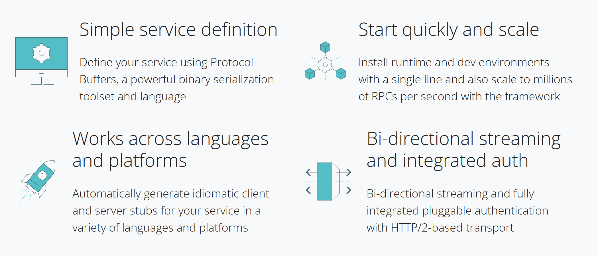

# gRPC

gRPC is a cross-platform open source high performance remote procedure call (`RPC`) `framework`.

it was initially created by Google, which used a single general-purpose RPC infrastructure called `Stubby` to connect the large number of `microservices` running within and across its data centers from about `2001`.

In `March 2015`, Google decided to build the next version of Stubby and make it open source. The result was gRPC, which is now used in many organizations aside from Google to power use cases from microservices to the "last mile" of computing (mobile, web, and Internet of Things). now it is part of `CNCF [cloud native computing foundation]`

It uses `HTTP/2` for transport, `Protocol Buffers` as the `interface description language`, and provides features such as authentication, `bidirectional streaming` and flow control, blocking or nonblocking bindings, and cancellation and timeouts. It generates cross-platform client and server bindings for many languages. Most common usage scenarios include connecting services in a microservices style architecture, or connecting mobile device clients to backend services.





# About RPC 

Remote Procedure Call is a `distributed computing technique` in which a computer program calls a procedure (subroutine or service) to execute in a different address space than its own. The procedure may be on the same system or a different system connected on a network.

The idea behind RPC is that a computer program can call and execute a subroutine on a remote system just like it would call a local subroutine, but the network communication details are hidden from the user.

RPC is a request–response protocol. it supports `process-oriented` and `thread-oriented` models.

The client makes a request to execute a procedure on the remote server. Like a synchronous local call, the client is suspended until the procedure results are back. The procedure’s parameters are passed over the network to the server-side. The procedure executes on the server and, finally, the results are transferred back to the client.


RPCs are a form of `inter-process communication (IPC)`, in that different processes have different address spaces: if on the same host machine, they have distinct virtual address spaces, even though the physical address space is the same; while if they are on different hosts, the physical address space is different. Many different (often incompatible) technologies have been used to implement the concept. 


# What does RPC do?

When program statements that use the RPC framework are compiled into an executable program, `a stub is included in the compiled code` that acts as the representative of the `remote procedure code`. When the program is run and the procedure call is issued, the stub receives the request and forwards it to a client runtime program in the local computer. The first time the client stub is invoked, it contacts a name server to determine the transport address where the server resides.

The client runtime program has the knowledge of how to address the remote computer and server application and sends the message across the network that requests the remote procedure. Similarly, the server includes a runtime program and stub that interface with the remote procedure itself. Response-request protocols are returned the same way.


# How does RPC work?

When a remote procedure call is invoked, the calling environment is suspended, the procedure parameters are transferred across the network to the environment where the procedure is to execute, and the procedure is then executed in that environment.

When the procedure finishes, the results are transferred back to the calling environment, where execution resumes as if returning from a regular procedure call.

see the `gRPC T1` directory code

During an RPC, the following steps take place:

    
1.  The client calls the client stub. The call is a local procedure call with parameters pushed onto the stack in the normal way.

2. The client stub packs the procedure parameters into a message and makes a system call to send the message. The packing of the procedure parameters is called marshalling.

3. The client's local OS sends the message from the client machine to the remote server machine.
    
4. The server OS passes the incoming packets to the server stub.

5. The server stub unpacks the parameters -- called unmarshalling -- from the message.

6. When the server procedure is finished, it returns to the server stub, which marshals the return values into a message. The server stub then hands the message to the transport layer.

7. The transport layer sends the resulting message back to the client transport layer, which hands the message back to the client stub.

8. The client stub unmarshalls the return parameters, and execution returns to the caller.


# About Stub

a stub is a `program` that acts as a temporary replacement for a remote service or object.It allows the client application to access a service as if it were local, while hiding the details of the underlying network communication. This can simplify the development process, as the client application does not need to be aware of the complexities of distributed computing. Instead, it can rely on the stub to handle the remote communication, while providing a familiar interface for the developer to work with. 

The stub represents a `remote object` or `service on a local system`. It acts as a `proxy` for the remote service and allows the client program to make method calls on the remote object as if it were local. The process of generating stubs involves creating a client-side proxy object that provides the same interface as the remote service, but routes method calls to the actual remote object

The main purpose of an RPC is to allow a local computer (client) to invoke procedures on a remote computer (server). Since the client and server have different address spaces, the parameters used in a function call must be converted. Otherwise, the parameter values would be unusable because pointers to parameters in one computer's memory would reference different data on the other computer. Also, the client and server can have different data representations, even for simple parameters like integers (e.g., big-endian versus little-endian). Stubs handle parameter conversion, making a remote procedure call look like a local function call to the remote computer.


# About Protocol buffers

Protocol Buffers (`Protobuf`) is a free and open-source cross-platform data format used to serialize structured data. It is useful in developing programs that communicate with each other over a network or for storing data.
The method involves an `interface description language` that describes the structure of some data and a program that generates source code from that description for generating or parsing a stream of bytes that represents the structured data.


//About Interface Description Language

An interface description language or interface definition language (IDL) is a generic term for a language that lets a program or object written in one language communicate with another program written in an unknown language. IDLs are usually used to describe data types and interfaces in a language-independent way, for example, between those written in C++ and those written in Java.

IDLs are commonly used in `remote procedure call software`. In these cases the machines at either end of the link may be using different operating systems and computer languages. IDLs offer a bridge between the two different systems. 


The definition of data to be serialized is written in configuration files called `proto files` with the extension `.proto`. These files contain the configuration known as messages.


// features of proto files

`Binary transfer format` The data is transmitted as binary. This improves the speed of transmission more than raw string because it takes less space and bandwidth.

`Separation of context and data` In JSON and XML, the data in context are not separable, whereas in Protobuf, it is separable.


`Message format` the data is transmitted as Protobuf based on a configuration file known as `messages`.


# types in Proto file

`syntax` syntax keyword used to version of proto file. like `syntax = "proto3";`

`message` keyword used to define user defined data types that consists collection of different fields(name/value pairs). like class,struct,object.

```proto 
message SearchRequest {
  string query = 1;
  int32 page_number = 2;
  int32 results_per_page = 3;
}
```

`package` keyword used to add some other `.proto ` files in your current proto file.

for example :  `import "google/protobuf/descriptor.proto";`

`Field Numbers` You must give each field in your message definition a number between `1` and `536,870,911`.

The given number must be `unique` among all fields for that message.

Field numbers `19,000 to 19,999 are reserved` for the Protocol Buffers implementation. The protocol buffer compiler will complain if you use one of these reserved field numbers in your message.

You cannot use any previously reserved field numbers or any field numbers that have been allocated to `extensions`.


`service` keyword used to define RPC service interface just like Query , Mutation types used in GraphQL.

If you want to use your message types with an RPC (Remote Procedure Call) system, you can define an RPC service interface in a .proto file and the protocol buffer compiler will generate service interface code and stubs in your chosen language. So, for example, if you want to define an RPC service with a method that takes your `SearchRequest` and returns a `SearchResponse`, you can define it in your .proto file as follows:

```proto 
service SearchService {
  rpc Search(SearchRequest) returns (SearchResponse);
}
```


//Specifying Field Labels 

`optional` The field is set, and contains a value that was explicitly set or parsed from the wire. It will be serialized to the wire.
The field is unset, and will return the default value. It will not be serialized to the wire.

`repeated` This field type can be repeated zero or more times in a well-formed message. The order of the repeated values will be preserved.

`map` this is a paired key/value field type.  like `map<string, Project> projects = 3;`


//Comment

To add comments to your .proto files, use C/C++-style `//` and `/* ... */` syntax.


# Data types in Proto 3

//Scalar Value Types

A scalar message field can have one of the following types – the table shows the type specified in the .proto file, and the corresponding type in the automatically generated class:


// Default Values

When a message is parsed, if the encoded message does not contain a particular implicit presence element, accessing the corresponding field in the parsed object returns the default value for that field. These defaults are type-specific:

    For strings, the default value is the empty string.
    For bytes, the default value is empty bytes.
    For bools, the default value is false.
    For numeric types, the default value is zero.
    For enums, the default value is the first defined enum value, which must be 0.
    For message fields, the field is not set. Its exact value is language-dependent. See the generated code guide for details.

The default value for repeated fields is empty (generally an empty list in the appropriate language).


// Enumerations 

When you’re defining a message type, you might want one of its fields to only have one of a predefined list of values. For example, let’s say you want to add a `corpus` field for each `SearchRequest`, where the corpus can be `UNIVERSAL`, `WEB`, `IMAGES`, `LOCAL`, `NEWS`, `PRODUCTS` or `VIDEO`. You can do this very simply by adding an enum to your message definition with a constant for each possible value.

In the following example we’ve added an enum called Corpus with all the possible values, and a field of type `Corpus`:


```proto 
enum Corpus {
  CORPUS_UNSPECIFIED = 0;
  CORPUS_UNIVERSAL = 1;
  CORPUS_WEB = 2;
  CORPUS_IMAGES = 3;
  CORPUS_LOCAL = 4;
  CORPUS_NEWS = 5;
  CORPUS_PRODUCTS = 6;
  CORPUS_VIDEO = 7;
}

message SearchRequest {
  string query = 1;
  int32 page_number = 2;
  int32 results_per_page = 3;
  Corpus corpus = 4;
}
```

As you can see, the Corpus enum’s first constant maps to zero: every enum definition must contain a constant that maps to zero as its first element. This is because:

There must be a zero value, so that we can use 0 as a numeric default value.
The zero value needs to be the first element, for compatibility with the proto2 semantics where the first enum value is the default unless a different value is explicitly specified


//Nested Types 

...


//Oneof 

...


# Writing A Protocol Buffer [protobuf file]

...


# To Generate Go Code from Protobuf

here we will generate go code from `.proto` files

please make attention to 3 points here 

protoc --go_out=`.` --go_opt=paths=source_relative --go-grpc_out=`.` --go-grpc_opt=paths=source_relative `protofiles/*.proto`

nowdayas grpc generate 2 go file code for `.proto` files so to locate those go code files we specfied the `.` location from where `.proto` files are located it will generate go code there itself.

`protofiles/*.proto` this means compile all `.proto` files from protofiles directory.


``` bash
protoc --go_out=. --go_opt=paths=source_relative --go-grpc_out=. --go-grpc_opt=paths=source_relative protofiles/*.proto
```

# How gRPC works?

first you write protocol buffer files {`.proto` files} than you generate code from your written protobuf code in any langauge.

after generating language code that you write logic for your schema proto file in that language.

once logic implemented than you define client side logic from where you can use those functions {services}.

after client logic done! you start your server. now you can use those services. 

`as we can use some functionality from client by invoking functions that is why it is called as remote procedure calls`

see the  `gRPC T2` where i implemented add and multiply logic  


# Why not RPC?

The client and server use different execution environments for their respective routines, and the use of resources (e.g., files) is also more `complex`. Consequently, RPC systems aren't always suited for transferring large amounts of data.

RPC is highly `vulnerable` to failure because it involves a communication system, another machine and another process.
There is no uniform standard for RPC; it can be implemented in a variety of ways.

RPC is only interaction-based, and as such, it doesn't offer any `flexibility` when it comes to hardware architecture.

some more disadvantages also discussed below in comparasion with GraphQL.


# gRPC vs GraphQL

Here we will compare gRPC and GraphQL in terms of some parameters...

`Payload` ::: Message size matters because smaller messages generally take less time to send over the network. gRPC uses `protocol buffers` (a.k.a. protobufs), a `binary format` that just includes values, while GraphQL uses JSON, which is text-based and includes field names in addition to values. The binary format combined with less information sent generally results in gRPC messages being smaller than GraphQL messages. (While an efficient binary format is feasible in GraphQL, it’s rarely used and isn’t supported by most of the libraries and tooling.) 
gRPC’s binary format is faster `serializing` and parsing of messages compared to that of GraphQL’s text messages. The downside is that it’s harder to view and debug than the human-readable JSON.

`Network` ::: gRPC uses `http/2` network protocol. http/2 provides `multiplexing` multiple requests over a single TCP connection (fixing the HTTP-transaction-level head-of-line blocking problem in HTTP 1.x). http/2 also provides many features like data compression etc.. which definatly going to reduce latency. while in GraphQL there is no such features.

`Streaming` ::: Both gRPC and GraphQL support the server streaming data to the client: gRPC has server streaming and GraphQL has Subscriptions and the directives @defer, @stream, and @live. gRPC’s HTTP/2 also supports `client and bidirectional streaming` (although we can’t do bidirectional when one side is a browser). HTTP/2 also has improved performance through multiplexing.
gRPC has `built-in retries` on network failure, whereas in GraphQL, it might be included in your particular client library, like Apollo Client’s RetryLink. gRPC also has built-in deadlines.

`Proxy` ::: gRPC is unable to use most `API proxies` like `Apigee Edge` that operate on HTTP headers, and when the client is a browser, we need to use` gRPC-Web proxy` or `Connect` (while modern browsers do support HTTP/2, there aren’t browser APIs that allow enough control over the requests).

// About Proxy Server

A proxy server is a `server application` that acts as an `intermediary between a client requesting a resource and the server` providing that resource.[1] It improves privacy, security, and performance in the process. 
Instead of connecting directly to a server that can fulfill a request for a resource, such as a file or web page, the client directs the request to the proxy server, which evaluates the request and performs the required network transactions. This serves as a method to simplify or control the complexity of the request, or provide additional benefits such as load balancing, privacy, or security. Proxies were devised to add structure and encapsulation to distributed systems.A proxy server thus functions on behalf of the client when requesting service, potentially masking the true origin of the request to the resource server.


`Schema` ::: in gRPC version 3 it does not have required fields: instead, every field has a default value. In GraphQL, the server can differentiate between a value being present and absent (null), and the schema can indicate that an argument must be present or that a response field will always be present.
there is no standard way to know whether a method will mutate state in gRPC. while in GraphQL, which has separated queries and mutations type. `Maps` are supported in gRPC but not in GraphQL: if you have a data type like `{[key: string] : T}`, you need to use a JSON string type for the whole thing.


`Underfetching` In gRPC, we call methods one at a time. If we need more data than a single method provides, we need to call multiple methods. And if we need response data from the first method in order to know which method to call next, then we’re doing multiple round trips in a row. Unless we’re in the same data center as the server, that causes a significant delay. This issue is called underfetching.

This is one of the issues GraphQL was designed to solve. It’s particularly important over high-latency mobile phone connections to be able to get all the data you need in a single request. In GraphQL, we send a string (called a document) with our request that includes all the methods (called queries and mutations) we want to call and all the nested data we need based on the first-level results. Some of the nested data may require subsequent requests from the server to the database, but they’re usually located in the same data center, which should have sub-millisecond network latency.


# Why gRPC ?

there are many reasons to use gRPC some of them are compared above with GraphQL.

`Communication between different languages` backend/frontend may be written in differnet languages. gRPC makes it easy to communicate between various microservices.

`Communication should be efficient` gRPC uses Http/2 and protobuf which makes communication between microservices so fast.


# References

`https://grpc.io`

`https://protobuf.dev/`

`https://en.wikipedia.org/wiki/HTTP/2`

`https://book.systemsapproach.org/e2e/rpc.html`

`https://www.javatpoint.com/what-is-rpc-in-operating-system`